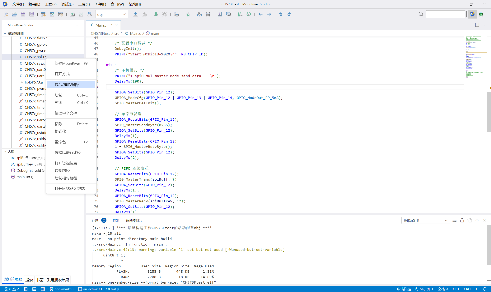
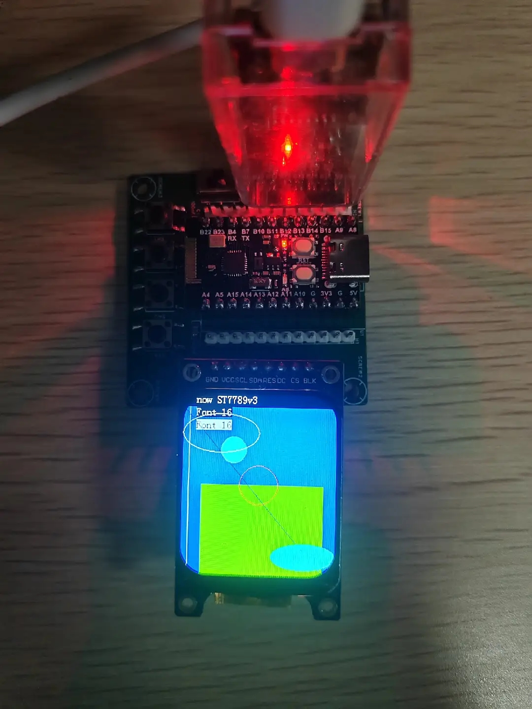
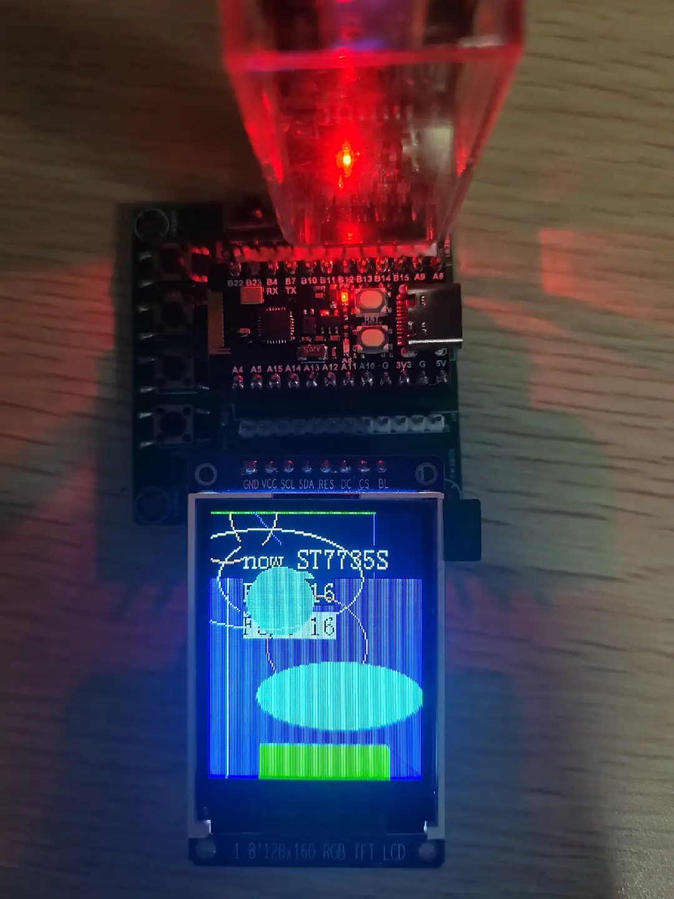

# CH573F_TFT
## 项目简介

本仓库基于南京沁恒公司CH573F微控制器移植了一套TFT显示屏驱动程序。支持2种TFT显示屏的初始化、图形绘制、英文文本显示功能。使用MounRiver(山河)平台编写。下载次仓库并使用MounRiver打开即可编译运行。由于适配了MounRiver平台，使用了GBK编码

移植代码时，参考了沁恒的SPI0示例程序： https://www.wch.cn/products/CH573.html 中的CH573EVT.ZIP。屏幕驱动程序移植自 https://github.com/2827700630/TFT_STM32F103C8

## 支持的 TFT 模块

| 型号     | 分辨率     | 尺寸   |
| -------- | ---------- | ------ |
| ST7735S (下图右边) | 128 × 160  | 1.8"   |
| ST7789V3 (下图左边) | 240 × 240  | 1.69"  |


## 硬件连接方式
| 屏幕     |  微控制器    |
| -------- | ---------- |
| GND      | GND       |
| VCC      | 3.3V     |
| SCL(SCK) | PA13 (SPI0_SCK) |
| SDA(MOSI)| PA14 (SPI0_MOSI) |
| TFT_CS   | PA12     |
| TFT_RES  | PA11 (也可以接到单片机的复位脚RST) |
| TFT_DC   | PA10     |
| TFT_BLK  | PB22 (也可以把它接到3.3V) |

## 文件结构

 ```
 ├── Ld/                     # 链接脚本
 ├── RVMSIS/                 # RISC-V CMSIS 核心
 ├── src/
 │   ├── Main.c              # 主程序
 │   ├── TFTc/               # TFT 驱动源文件
 │   │   ├── font.c          # 字体库
 │   │   ├── TFT_CAD.c       # 绘图函数
 │   │   ├── TFT_init.c      # 初始化函数
 │   │   └── TFT_io.c        # 底层 IO 函数
 │   └── TFTh/               # TFT 驱动头文件
 │       ├── font.h
 │       ├── TFT_CAD.h       # 绘图函数声明
 │       ├── TFT_config.h    # 配置文件 (引脚, 方向, 缓冲区, 颜色)
 │       ├── TFT_init.h      # 初始化函数声明
 │       └── TFT_io.h        # 底层 IO 函数声明 (SPI, GPIO)
 ├── Startup/                # 启动文件
 ├── StdPeriphDriver/        # 标准外设驱动
 ├── obj/                    # 构建输出目录
 ├── makefile                # 构建脚本
 └── README.md               # 本文件           
 ```

## 如何移植到其他工程
1.将TFT.c和TFT.h两个文件夹拷贝到你的工程目录src中
2.参考main.c中的示例程序，在你的main.c中添加初始化代码和调用代码

## 说明
1. 我使用的是无名科技的CH573F开发板 https://www.nologo.tech/product/otherboard/CH573F.html
2. 在新工程中，如果遇到SPI编译错误，请按照下图开启SPI的编译

3. SPI0引脚定义在TFTio.c文件中的SPI0_MasterDefInit函数之前。移植到其他平台时请确认GPIO编号是否一致。CH573F只有一个硬件SPI。在我的驱动中已经使用了DMA传输。
4. 目前只支持字号为16的英文显示，且使用函数时必须设置背景不透明
5. 如果想添加新的屏幕，只需要在TFT_init中添加相应的初始化函数，并在主程序中调用即可。
6. 显示效果如下图。我为了Main.c测试程序的兼容，并没有做合适的位置布局。你可以修改显示位置


7. 遇到bug请提交issue
